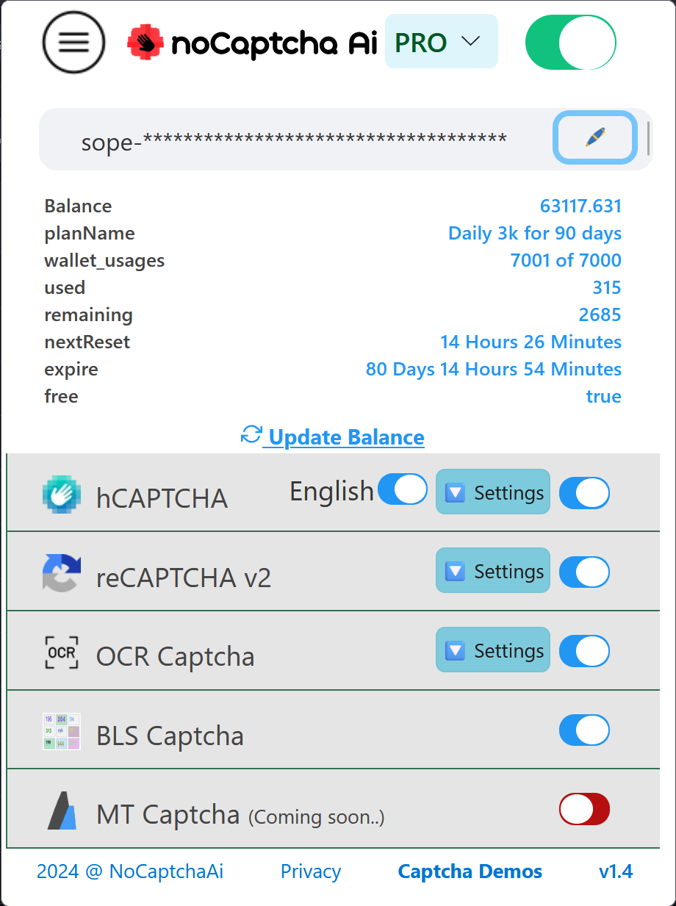

# noCaptchaAi: CAPTCHA Solver for Firefox

- hCAPTCHA
- reCAPTCHA v2
- OCR/ImageToText
- BLS OCR Captcha
- more

### 👉 [Download Latest for Firefox](https://github.com/noCaptchaAi/firefox-addon/releases/latest)

### 👉 AUTO URL configurator ~ [newconfig.nocaptchaai.com](https://newconfig.nocaptchaai.com)

### 👉 Looking for Chrome Extension?  [Download White Edition](https://github.com/noCaptchaAi/chrome/releases/latest) | [Download Dark Edition](https://github.com/noCaptchaAi/chrome-extension/releases/latest)

## Features

- Uses Blazing fast (hcaptcha :zap: 0.02s ) machine learned API from NoCaptchaAi.com
- hCAPTCHA (Grid, multi select and Bounding Box Challenges - Means most)
- reCAPTCHA v2 Image (free while beta)
- reCAPTCHA v2 Audio
- OCR or Image to Task Captcha [all supported list here](https://docs.nocaptchaai.com/en/image/ImageToText.html)
- Automate your deployment with URL Config --> https://newconfig.nocaptchaai.com
- Export extension Settings JSON
- Featureful easy OCR element picker
- EXPORT/IMPORT/MERGE OCR site data within extension
- Custom endpoints (if elligible on plan) and so many more

# Suppported Firefox Versions:

- Firefox Nightly [download](https://www.mozilla.org/en-US/firefox/channel/desktop/#nightly)
- Firefox Beta [download](https://www.mozilla.org/en-US/firefox/channel/desktop/#beta)
- Firefox ESR [download](https://www.mozilla.org/en-US/firefox/enterprise/#download)
- Firefox Developer Edition [download](https://www.mozilla.org/en-US/firefox/developer/)

# Install

- Visit `chrome://extensions/`,
- Enable `Developer mode [ ]` if not already
- Click `│ │ Load unpacked │ │` and Select folder OR Drag n drop `chrome` folder on this page, DONE!
- Visit dash for APIKEY and Use [newconfig](https://newconfig.nocaptchaai.com) to automate your desired config

